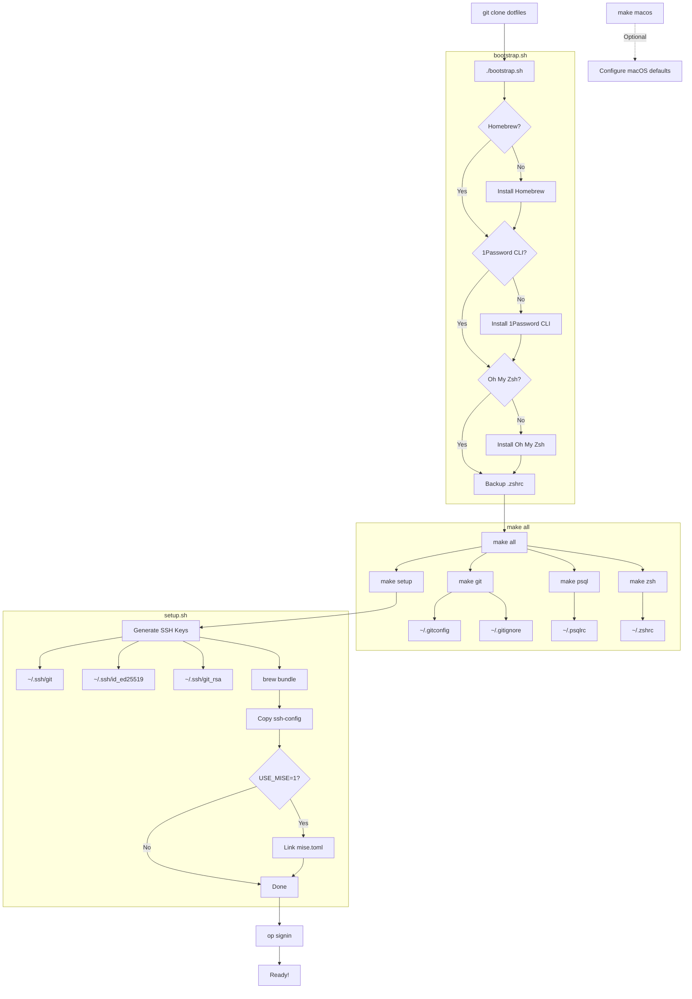

# Dotfiles

Personal dotfiles for macOS. Includes shell configuration, git settings, and development tools.

## Installation Flow



## What's Included

| Config | Description |
|--------|-------------|
| `zshrc` | Zsh configuration with Oh My Zsh, aliases, and PATH setup |
| `gitconfig` | Git settings with SSH signing, aliases, and diff-so-fancy |
| `gitignore` | Global gitignore patterns |
| `psqlrc` | PostgreSQL CLI configuration |
| `ssh-config` | SSH client configuration |
| `mise.toml` | Version manager for Go, Node, Python |
| `Brewfile` | Homebrew packages and casks |
| `macos.sh` | macOS system preferences automation |

## Requirements

- macOS (Apple Silicon or Intel)
- Git

## Install

1. Clone the repository:
   ```bash
   git clone https://github.com/BolajiOlajide/dotfiles.git ~/.dotfiles
   cd ~/.dotfiles
   ```

2. Run the install:
   ```bash
   ./bootstrap.sh && make all
   ```

3. Sign in to 1Password CLI:
   ```bash
   op signin
   ```

This will:
- Install Homebrew (if not present)
- Install 1Password CLI (for secrets management)
- Install Oh My Zsh (if not present)
- Create symlinks for all config files
- Generate SSH keys
- Install packages from Brewfile

## Makefile Targets

```bash
make all        # Full setup (bootstrap + symlinks + setup)
make bootstrap  # Install Homebrew, 1Password CLI, and Oh My Zsh
make setup      # Generate SSH keys, install brew packages
make macos      # Configure macOS system preferences
make git        # Symlink git config files only
make zsh        # Symlink zshrc only
make psql       # Symlink psqlrc only
```

## Homebrew

Update Brewfile from currently installed packages:
```bash
brew bundle dump --force
```

Install packages from Brewfile:
```bash
brew bundle --file=./Brewfile
```

Remove packages not in Brewfile:
```bash
brew bundle cleanup --force --file=./Brewfile
```

## Key Features

- **Apple Silicon compatible** - Uses `$HOMEBREW_PREFIX` for portable paths
- **1Password integration** - Secrets loaded via `op` CLI (no plaintext files)
- **SSH signing** - Git commits signed with SSH key
- **Modern tools** - bat, fzf, ripgrep, diff-so-fancy, atuin
- **Version management** - mise for Go, Node, Python
- **Docker** - OrbStack integration
- **macOS automation** - System preferences via `defaults` commands

## Shell Aliases

| Alias | Command |
|-------|---------|
| `HEAD` | `git push origin head` |
| `HEAD+` | `git push --force-with-lease origin head` |
| `check` | `git checkout` |
| `gst` | `git status --short` |
| `ga` | `git add` |
| `gd` | `git diff` |
| `gc` | `git commit` |
| `cat` | `bat` |
| `ping` | `prettyping` |
| `nuke` | Remove node_modules and reinstall |

## License

MIT
