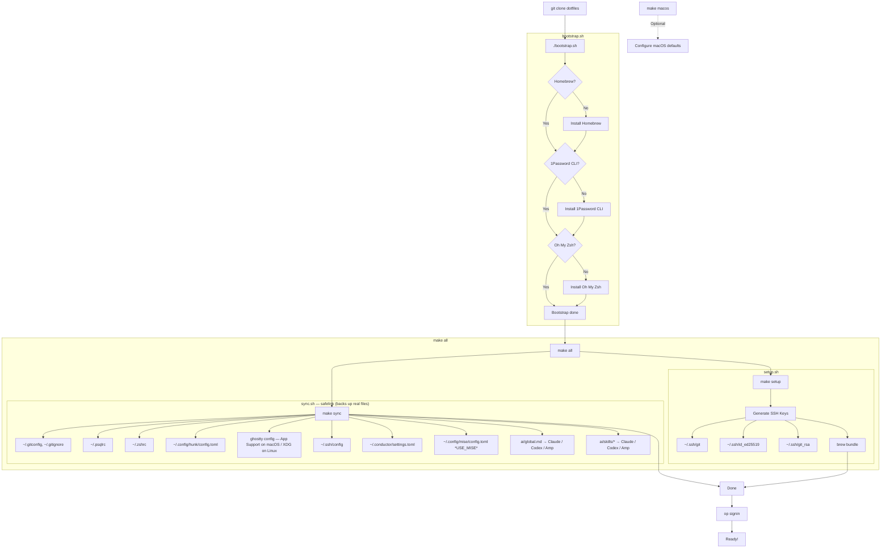

# Installation Flow

How the install scripts and `make` targets fit together, from `git clone` to a
ready environment. See the [README](../README.md) for usage.

```mermaid
flowchart TD
    A[git clone dotfiles] --> B[./bootstrap.sh]

    subgraph bootstrap["bootstrap.sh"]
        B --> C{Homebrew?}
        C -->|No| D[Install Homebrew]
        C -->|Yes| E{1Password CLI?}
        D --> E
        E -->|No| F[Install 1Password CLI]
        E -->|Yes| G{Oh My Zsh?}
        F --> G
        G -->|No| H[Install Oh My Zsh]
        G -->|Yes| I[Bootstrap done]
        H --> I
    end

    I --> J[make all]

    subgraph makefile["make all"]
        J --> SY[make sync]
        J --> N[make setup]

        subgraph sync["sync.sh — safelink (backs up real files)"]
            SY --> K1[~/.gitconfig, ~/.gitignore]
            SY --> L1[~/.psqlrc]
            SY --> M1[~/.zshrc]
            SY --> H1[~/.config/hunk/config.toml]
            SY --> G1[ghostty config — App Support on macOS / XDG on Linux]
            SY --> SC[~/.ssh/config]
            SY --> CD[~/.conductor/settings.toml]
            SY --> MI[~/.config/mise/config.toml *USE_MISE*]
            SY --> AG[ai/global.md → Claude / Codex / Amp]
            SY --> SK[ai/skills/* → Claude / Codex / Amp]
        end

        subgraph setup["setup.sh"]
            N --> O[Generate SSH Keys]
            O --> O1[~/.ssh/git]
            O --> O2[~/.ssh/id_ed25519]
            O --> O3[~/.ssh/git_rsa]
            O --> P[brew bundle]
        end
    end

    SY --> T[Done]
    P --> T
    T --> U[op signin]
    U --> V[Ready!]

    W[make macos] -.->|Optional| X[Configure macOS defaults]
```
